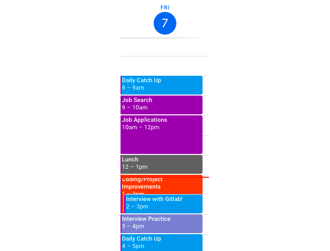

# How to use Google Calendar to get (and stay) organized and efficient!

The first and most important step of managing your Google Calendar is this: just use it.

Using your Google Calendar is necessary. But there are tips and tricks you can take advantage of that will make using your Google Calendar organization simpler and even more useful. We’ll start with basic organizational strategies, and then discuss some of the cool features Google Calendar offers--features that will hopefully allow you to take control of your schedule, rather than having your schedule control you!

**Before you begin**

Before you start diving into tips and tricks, make sure that you fully understand how to use Google Calendar’s core features: scheduling, creating calendars, setting events to repeat, etc. The video below offers a clear, thorough tutorial on these primary features. If you already feel very confident in your knowledge of Google Calendar, feel free to skip it, but if you would like a refresher (or if you’re not 100% sure how to manage your calendar), we strongly recommend it.

https://www.youtube.com/embed/1EjJ55BODn0

**Time blocking: how to use Google Calendar to enforce our favorite time management strategy**

If you’ve ever struggled with time management and done some research online, you may have heard of time blocking. Time blocking is a simple strategy: rather than creating “to-do” lists and checking things off, you’ll instead “block” off specific timeframes on your calendar for specific tasks. Then you stick to those time blocks, even if it means having to pause a task before you’re done in order to move on to the next event.

Microverse already encourages the use of time blocking: you can find your suggested schedule on the student dashboard, and the collaborative aspect of Microverse helps all students stick to that schedule.

Here’s an example of what a job searching student’s Google Calendar might look like:

The key to time blocking is **sticking to it**. In the example above, a student might dedicate the first hour of their day to “catching up--” answering emails, responding to interview requests, completing a few tasks they didn’t get the chance to finish yesterday. However, as soon as the clock hits 9 o’clock, it’s time to search for job applications, even if they didn’t finish catching up on emails or messages. That student might then spend an hour bookmarking job postings. Then, as soon as it’s 10 o’clock, the student will stop searching, and start working on their applications.

Time blocking keeps one task from taking up your entire day and preventing you from working on other, equally important tasks. It also, however, allows for flexibility.

**Google Calendar lets you schedule multiple events in the same time period. That means you can be flexible.**

Most of us follow a pretty similar schedule on a day-to-day basis. Most of us also know, though, that exceptions occur. Sometimes we have doctor’s appointments. Sometimes our whole town suffers a power failure. And sometimes we schedule interviews!

Luckily, Google Calendar knows this, and it allows you to “double-book” time slots--that way, you can add one-time-only events without having to re-do your entire schedule.

Let’s use the example above of a job searching student. This job searching student normally spends two hours between 1:00 PM and 3:00 PM working on coding and project improvements. However, today, the student has a one-hour interview scheduled at 2:00 PM! Instead of deleting their normal “Coding/Project Improvement” event, the student can instead schedule a new event on top of it! Their updated schedule will look like this:

**Google Calendar also lets you create multiple calendars**

Double-booking can be very useful, and there’s nothing wrong with managing your calendar in this way. If you want to get even more organized, however, Google Calendar also offers you the ability to create multiple calendars. In other words, you can have a calendar for daily tasks, another calendar specifically to manage interviews, a third calendar to manage appointments and errands--if multiple calendars would make your organization simpler for you, Google offers that ability! Learn how to use Google Calendars with the video below:

https://www.youtube.com/embed/soy2mPEVLcY

That’s a basic overview of how to use time blocking and Google Calendar’s flexible “double-booking” and multi-calendar features. However, those are just the basics. Now let’s discuss tips and tricks to make your Calendar work for you.

**Set up working hours**

When you’re working in a remote/distributed team, everyone’s going to have slightly different working hours. This is great for flexibility, but it’s less great when a coworker keeps adding 5:00 AM meetings on your calendar. Adding your working hours to your calendar will help prevent this--anytime someone attempts to schedule a meeting outside of those working hours, they’ll be given an alert that lets them know you aren’t working at that time. Need instructions? Find them here:

https://www.youtube.com/embed/p1UJdgMVZYE

We've listed the first few and basic calendar management practices above, but there are many other calendar management practices to be implemented using your Google Calendar. Go to the main activity page for additional resources and tutorials.

------

_If you spot any bugs or issues in this activity, you can [open an issue with your proposed change](https://github.com/microverseinc/curriculum-transversal-skills/blob/main/git-github/articles/open_issue.md)._
