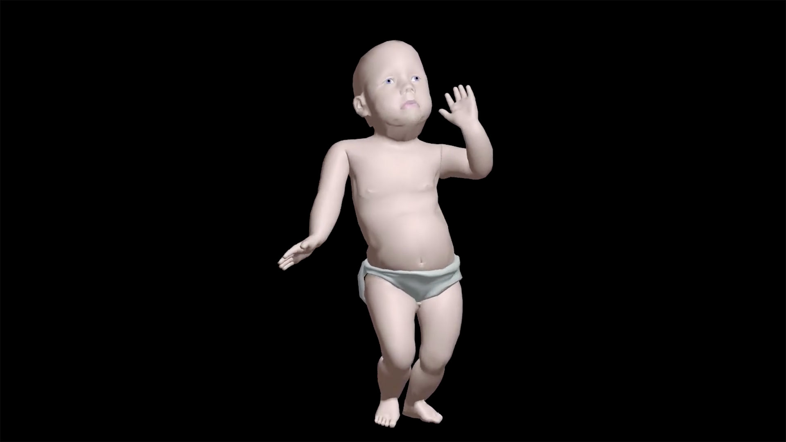
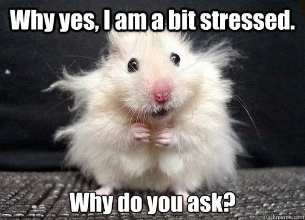

# Morning session: Laughing together with memes part 1

## Learning objectives

- Appropriately use humor as a tool for bonding with teammates and managing stress.

### **Estimated time**: 0.5h

## Description

We all know what memes are, but have you ever created one? In this exercise, you will be learning more about memes and why they are considered good stress relief. Then, you have the chance to create your own Microverse and capstone-themed memes. 

### What is a meme?

*Read through the following section on your own while staying on the Zoom call with your group. Spend 5 minutes on this section.* 

A meme is an image or a video that displays a certain concept, idea, behavior, or style that is shared online, mostly through various social media platforms. The purpose of a meme is usually to make the viewer laugh by poking fun at a cultural symbol or social idea.

Memes are older than you think. The word meme originated in 1967 from a British scientist who coined it while researching memes from hundreds of years back. Although it is difficult to determine what was the first meme ever made, did you know that Dancing Baby is considered to be the first internet meme ever? 

Today, most memes can be divided into two categories: 

- Traditional memes - a stock photo or a screenshot from a movie, viral video, or magazine. Typically these have text that fits the visual tone of the photo added to them.
- Dank memes - these involve absurd or out-of-context humor. Dank memes are also often an attempt to bring back a dying meme by overusing it constantly.

### Why are memes good for your health?

Today's fast-paced, constantly changing and ever-connected world tends to leave us feeling stressed. Although stress is a normal feeling nowadays, and you might have experienced it yourself in the past few weeks at Microverse, it is imperative to know how to mitigate it. One of the best methods to relieve stress is through jokes and laughter! It has been proven that laughing produces endorphins (happy chemicals in the brain) and relaxes the body. 

By creating or viewing acceptable and humorous content, memes provide beneficial distractions and make you laugh. The humor in memes can be seen as temporary anxiety relief, as well as a community builder when you laugh with a group of peers. 

## Exercise

### Instructions

*Check out this FAQ if you need a refresher on [Google Doc submission best practices](https://microverse.zendesk.com/hc/en-us/articles/360063156813)*

**Spend the next 5 minutes going through the instructions as a team.**

1. As this is your capstone week, we would like you to create a few capstone-themed memes - share how you are feeling about the capstone and what are you going through. Memes you create need to be respectful but can be as silly as possible. Your ultimate goal is to make your peers laugh. 
2. Each of you will create at least 3 memes. 
3. In the last 10 minutes of the call, you will share **one** of your memes and laugh together with your team. 
4. Save the other 2 memes for part 2 of this activity on Wednesday.

**Exercise template to copy:** [Laughing together with memes part 1](https://docs.google.com/document/d/1L-Wq1uhvB4q6r2UKgO-n2basQGCNv2d-rCq92GFk62I/edit#heading=h.o5f0hh3t060t)

### Submit your exercise

*Read [this FAQ](https://microverse.zendesk.com/hc/en-us/articles/360061344234) for a reminder on how to submit your exercise.* 

Now go to your Student Dashboard and submit your exercise.

## Additional materials

*These are all optional, but if you're interested in exploring this topic further, here are some resources to help you. Any exploration here should be done outside program time.*

- [What is a meme? Here’s everything you need to know](https://www.digitaltrends.com/computing/what-is-a-meme/)
- [I found the world's first meme with help from meme historians](https://www.thrillist.com/entertainment/nation/first-meme-ever)
- [Stress relief from laughter? It's no joke](https://www.mayoclinic.org/healthy-lifestyle/stress-management/in-depth/stress-relief/art-20044456)
- [Funniest work memes ever](https://www.dockethq.com/resources/funniest-work-memes-ever/)

------

_If you spot any bugs or issues in this activity, you can [open an issue with your proposed change](https://github.com/microverseinc/curriculum-transversal-skills/blob/main/git-github/articles/open_issue.md)._
