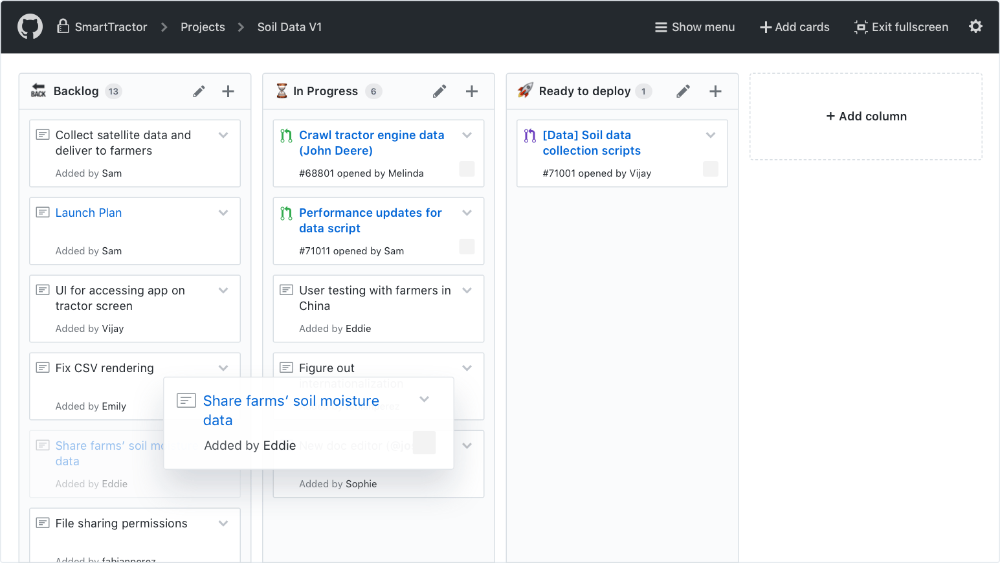

# What is a Kanban board?

A Kanban board is a way of organizing and viewing your team's work that emphasizes an ability to see many different tasks at once and how they relate to one another, which is especially useful for project managers and team leads. Each task is usually shown in a box — known as a "card" — with a brief description of the work. It is usually preferred to have just one task per card to keep things simple. Each card is then usually shown in a grid with different columns; each column representing different stages of completion of the task, such as in progress, under review, done, etc.

### How does Kanban differ from Scrum?

At Microverse, you are already familiar with Scrum. The Kanban method has a lot of similarities with Scrum, but there are some important differences. For example, in Kanban, there are often no sprints. Instead, work is added to your queue whenever you have finished a task. Kanban also sometimes implies more flexible roles on the team whereas with Scrum you are encouraged to have a clear product owner or scrum master. It is often said that Kanban is more appropriate for teams that change priorities quickly while Scrum is good for teams with a more predictable delivery schedule or a mature product. This may not be information you will use right now, but it's helpful to be familiar with these terms as you move forward in the software development industry.

### Introduction to GitHub Projects

At Microverse, you are familiar with GitHub already. One of GitHub's especially useful features is known as GitHub Projects which allows you to arrange GitHub issues on a Kanban board.

Take a look at [this video to see how to use the GitHub Projects Kanban board](https://www.loom.com/share/2d7f38b91a4b472c8b8cfaeab8eb2c68).

------

_If you spot any bugs or issues in this activity, you can [open an issue with your proposed change](https://github.com/microverseinc/curriculum-transversal-skills/blob/main/git-github/articles/open_issue.md)._
