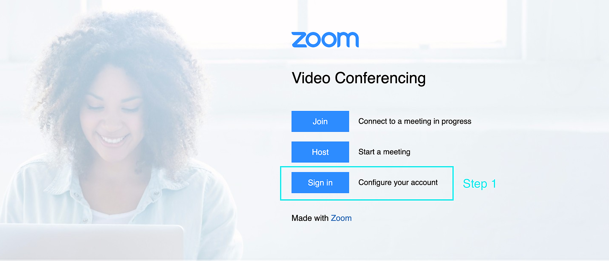
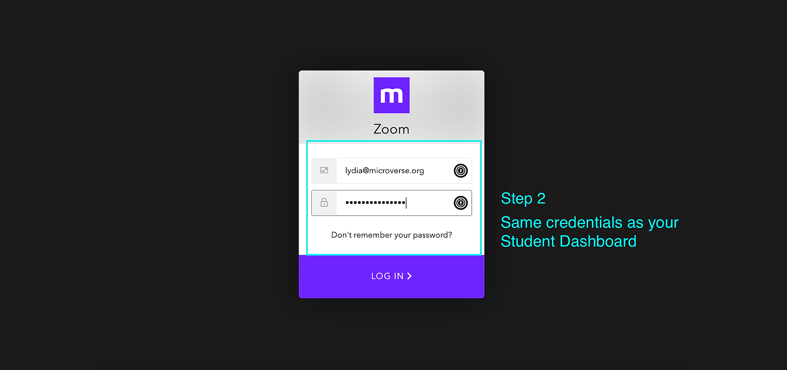
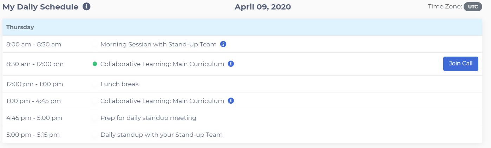

# Connect your Zoom account to your Dashboard

Zoom is the video call platform we use to connect you to both your coding partner or learning partner and standup team. We also use Zoom to track your attendance, so if it's not set up properly you will be counted as absent. We have fully integrated Zoom into your student dashboard so all you need to do is link your dashboard to the **Microverse Zoom account**. If you already have a Zoom account we still need you to read this article and follow the instruction so that you link your dashboard to your **Microverse Zoom account**. If you don't do this it will likely lead to issues in the near future which will prevent you from making progress in the curriculum and could lead you to be detected as absent from your meetings.

After you have completed this tutorial you should be able to meet your coding partner using the Join Call Button on your Dashboard. Let's get started.

**Link your Dashboard to the Microverse Zoom account**

1. Please [click this link to visit the Microverse Zoom login page](https://microverse.zoom.us/) as shown below. Then you need to click the 'Sign in' button highlighted below.

2. After you have clicked **'Sign in**' you should see the page below. Please sign in using your **Microverse Student Dashboard credentials**. It's really important that you sign in using the same information that you used to login to the dashboard so that we can link your Zoom account to your dashboard. If you need help with this, please reach out to us via Zendesk.

If you didn't see the screen below, but instead you were taken to your personal Zoom account you need to log out of your Zoom account, clear your cookies and repeat the step above until you see the screen below.

3. If everything worked you should now be logged into the Microverse Zoom account! **It's important that you always use the Microverse Zoom account to attend your meetings or you will be detected as absent.**

Now that you have linked your dashboard to our Zoom account you should be able to meet your coding partner in your first collaborative learning session! Let's check that everything works.

**Use the Join Call Button**

[Click this link to go to the Dashboard](https://dashboard.microverse.org/dashboard). You should scroll down the page to see your daily schedule as below. If you were successful in setting up your Zoom account you should see the Join Call button. If you can't see the Join Call button keep reading.

### Troubleshooting Issues

**I can see the Join Call button but I am prompted to enter the meeting by typing in my name**

If this is happening something went wrong! Even though you can type in your name, you should not connect that way because it means something did not go right and it can potentially impact your attendance in the future. To avoid this, make sure you log out of Zoom, clear all of your cookies and then repeat this process in a private window.

**I don't see the Join Call button**

-Please note you will not be able to see the Join button before your First day of the programme. 

There could be a few reasons why you don't see the Join Call Button. Follow these steps to figure out what might be going wrong. 

- **Has your dashboard had time to update?** The first reason is that the first time you connect your Zoom account to your Dashboard, the Dashboard has not yet updated and needs to refresh before you can see the button. If this is the first time you connect, please wait for 15 minutes, and if the button does not appear, keep reading.
- **Is it the right time of day?** The Join Call Button appears only at certain times of the day. In the screenshot above you can see that the Join Call Button has appeared for the first collaborative learning session. Please check that you should be able to see the Join Call Button right now based on your program timezone and your local time. Remember that the times shown in the schedule are not your local time but the timezone of the program you signed up for,also , you will not be able to see the join button until 5 minutes before the start time.
- **Still not working?** If you have waited 15 minutes and confirmed that you are in the program time for your time zone, please reach out to us using the Support button on your Dashboard explaining that you have followed the steps in this article but you cannot see the Join Call Button. Make sure to send us a screenshot of your schedule and a link to this article.

------

_If you spot any bugs or issues in this activity, you can [open an issue with your proposed change](https://github.com/microverseinc/curriculum-transversal-skills/blob/main/git-github/articles/open_issue.md)._
