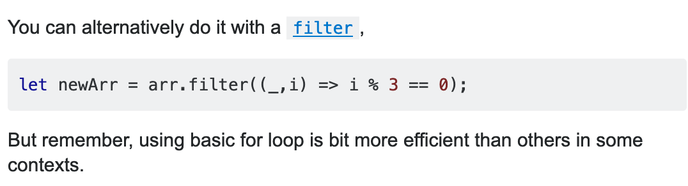

# Understanding plagiarism at Microverse: Examples

In order to make sure you have fully understood our definition of plagiarism, as well as our plagiarism guidelines, below are a few example cases.

Go through them and make sure you understand why each case is or is not plagiarism.

## Case 1: Good Practice

The assignment is called pledge the 5th.

You forgot how to loop through an array in JavaScript, so you google:

*How to loop through array, and print nth value*

This example is found:

This doesn’t exactly do what you need, but it shows how *for* loop can be used in a similar case.

You copy the *for* loop but remove the content that is inside the loop as it is not relevant to your problem. You try googling "how to select the nth element in an array." Solution that is found is:

This piece of code makes you remember that the modulo option (%) will be very helpful here. The rest of the code you don’t really understand yet.

You use the module (%) inside of the loop skeleton you copied before and end up with this. In this case you have copied some general code (the structure of the for loop) and applied a concept to your own problem, this is good practice.

## Case 2: Bad Practice

You google for the name of the specific assignment “I pledge the 5th” and “solution javascript”.

You find the solution online, and simply copy and paste the code. You change some variable names, and add a comment. You do not understand what it does.

This is bad practice, because you don’t really understand why it works, and you haven’t even tried to write the function. Most importantly, you have looked up a solution for a **specific complete assignment, which is strictly forbidden at Microverse.**

**This would be flagged as plagiarism.**

## Case 3: Good Practice

You google “how to print every nth value of an array javascript” and find a StackOverflow answer to a question on how to print every ***third\*** value of an array.

You think this could solve the problem, so you look up how the filter function works in JavaScript. Once it is understood, you use the code above in the solution. Now, 3 and 5 are changed, and the solution is:

In this case you copied a part of solution, **but didn’t copy from a direct solution to a specific assignment** (by googling for solution for [*assignment name]).* Problem was solved by looking at a solution to a similar problem, and then by using only parts  that were relevant.

Just to be sure, you leave a come for the Code reviewer mentioning where you found the solution and how you modified it.

## Case 4: Bad Practice

A website has to be rebuilt from scratch.

As you do not want to do too much work, you enthusiastically start copying large parts of the website’s html. This is much easier than writing it by yourself! Little parts of CSS are written by yourself, and just a few HTML tags are changed.

The original HTML:

Your "changed HTML” :

This is very bad practice, as the point of the assignment is to rebuild a website from scratch, and see how you can build a website that looks the same. If you copy the majority of the existing website's code, you will not learn how to write HTML properly, and will not know how to build a new design handed to you in a job.

**This would be flagged as plagiarism.**

------

_If you spot any bugs or issues in this activity, you can [open an issue with your proposed change](https://github.com/microverseinc/curriculum-transversal-skills/blob/main/git-github/articles/open_issue.md)._
