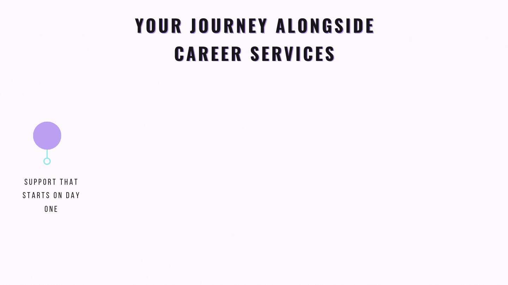

# What does Career Services offer you?

We've created a video to introduce you to Career Services at Microverse. Please click below to watch the video, and you can follow along with the written version below the video as well, or use it as a reference later.

### **[Click here](https://drive.google.com/file/d/1eae6edgcTMxayUmxsgcZQtnnv1_ZBqPZ/view?usp=sharing)**

## Transcript of the video

**Introduction**

Hello, and welcome! We're so happy to have you as part of Microverse, and we hope you're just as excited as we are. Today we'll be learning about Career Services at Microverse. Career Services is an invaluable resource: we'll be working with each and every one of you over the next few months to make sure that you're ready to succeed in your job search and in a professional working environment. But before you can take advantage of Career Services as a resource, it's important to understand who we are, what we do, and all the ways we'll be helping you as you work through the curriculum and prepare for your job search.

**About us**

The Career Services team at Microverse is made up of career coaches, educators, software developers, and recruiters with decades of experience between us. We've all spent much of our careers mentoring and helping others gain the professional skills needed in order to land job interviews, pass those interviews with flying colors, and ultimately become valued members of any professional team, and the reason we're here at Microverse is to use all of that knowledge and experience in your service.

Over the course of your time at Microverse, Career Services will work alongside you, providing you support, guidance, and advice as you start preparing for the next step in your development journey.

**Office Hours**

From your very first day at Microverse, you'll have access to the Career Service team. Each week, one of our career coaches will host Office Hours, where any student (whether or not they already have an assigned career coach) can show up and ask any question they may have. Any time you're struggling with the professional skills curriculum, with networking, or even with emotional issues like imposter syndrome, you're welcome to come to Office Hours and ask questions, or even just listen to questions asked by other students.

**On-Call Coach**

If you'd prefer one-on-one help, or if you need a more immediate response—for example, if you need help preparing for an interview, or you have a job offer you'd like to discuss—you'll also have access to our on-call career coach. Our career coach on-call rotates each week, and from day 1, will be available to provide you with personalized advice or assistance for nearly anything you need. Reach out to us via Zendesk for on-call assistance; we respond to all communication about job offers within 24 hours, and try to reply to every message in a timely fashion.

**Application materials**

As part of the Microverse curriculum, you'll complete lessons and exercises having to do with professional skills and application materials: everything you need in order to apply for a job in tech, from GitHub and LinkedIn profiles to resumes and cover letters. As you start working on your job application materials, you'll begin receiving feedback from our team of project reviewers. Project reviewers and student project reviewers work alongside Career Services to help you improve your application materials, providing you with measurable feedback and advice on how to make sure that your resumes, online profiles, GitHub accounts, and more are professional, well-edited, and compelling.

**Interview preparation**

After you've prepared all of your application materials, you'll then start working on interview preparation, where you'll learn how to prepare for technical interviews, how to answer behavioral questions, and how to handle any of the challenges you may face during the interview process.  Our career coaches will support you as you work through the Interview Prep curriculum and learn the skills needed to succeed in interviews, from phone screens to take-home assignments.

**Assigning a career coach**

Once you're nearly ready to start job searching, you'll be assigned a career coach. You'll meet with your career coach on a weekly basis, and they'll support you as you apply for jobs, build projects, and continue strengthening your resume and application materials.

**Personalized job search plan**

Your career coach will also work with you to create a personalized job search plan: you'll discuss factors like short-term and long-term goals, salary expectations, and other criteria, and then use that combination of factors to create a job search plan that will work for you and help you get that much closer to your next role in software development.

**Application help**

Once you're ready to start job searching, your career coach will also provide assistance with learning how to tailor application materials to specific jobs. Tailoring your job applications for each role you apply to is an important skill, but one that many people disregard. Your career coach will help teach you the skills needed in order to successfully and quickly tailor your job applications each time you apply for a new role, and will provide specific advice as needed.

**Interview support**

And once you start going through interviews, your career coach will help support you through the interview process, as well, from the initial application and phone screen all the way to the final interviews. This support might take a number of forms: they may help you brainstorm responses to questions in the initial application, for example, or they may help you learn how to conduct research into reasonable salary expectations. The support your career coach provides will help you as you navigate the interview process for any job, and will teach you skills you'll be able to use for the rest of your career.

**Job offer support**

Once you've received a job offer, your career coach will work with you on salary negotiations. Students who negotiate their offers tend to have higher starting salaries than those who don't; your career coach will be available to offer advice on how to negotiate carefully and respectfully, so that you'll be able to start your next role in software development with a salary as closely in line with your needs as possible.

**After you start working**

Even after you leave Microverse and start working, Career Services will still be here to support you. We'll reach out periodically to check in with you and see how you're doing, and to offer resources that can help you succeed in your new jobs. And when you're ready to start looking for your next job, you can return to us as a part-time or full-time job seeker; we'll work around your schedule to help you search for your next job even while you're still employed, so that your next position will be even better.

### Conclusion

Career Services at Microverse exists to help you navigate interviews, job searching, and the professional working environment. Just as importantly, though, we also exist to help provide you with accountability and emotional support. Whatever career-related question you may have, Career Services will always be available to you, even once you've completed Microverse and taken your next steps in the world of software development. We can't wait to meet you individually, and we look forward to getting to know you over the next few months.

Again, congratulations, and welcome to Microverse!

------

_If you spot any bugs or issues in this activity, you can [open an issue with your proposed change](https://github.com/microverseinc/curriculum-transversal-skills/blob/main/git-github/articles/open_issue.md)._
