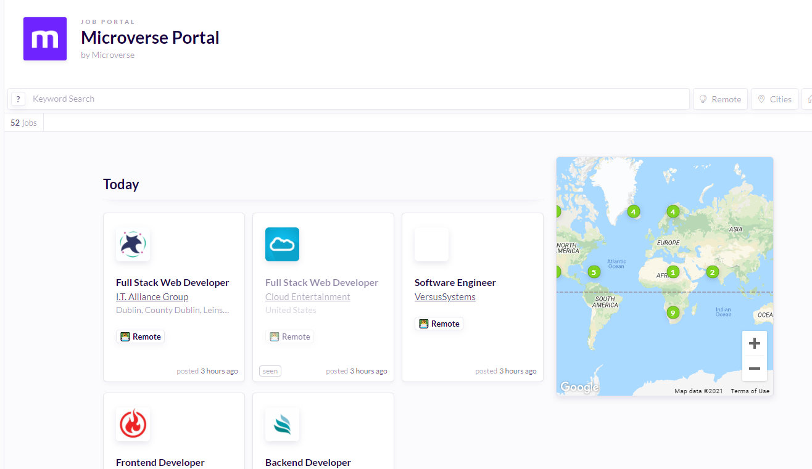

# Introducing the Microverse portal

Every week, career coaches will be curating job opportunities that we believe will be a fit for some of our Micronauts and adding them to Huntr to make it even easier for you to apply to new jobs and achieve your career goals as quickly as possible. Here's an image of what the Microverse portal looks like:

[You can click here to check out the job portal](https://huntr.co/microverse/job-portal) and start adding some of these jobs to your Huntr board. **Make sure you are currently logged into Huntr so you can see the relevant postings.**

**You can watch the loom video below for an example of how to add a job to your board:**

[Video to watch: see an example of how to add a job to your Huntr board](https://www.loom.com/share/191c83c20acb4e38a3d72f8d07f55b76)

------

_If you spot any bugs or issues in this activity, you can [open an issue with your proposed change](https://github.com/microverseinc/curriculum-transversal-skills/blob/main/git-github/articles/open_issue.md)._
